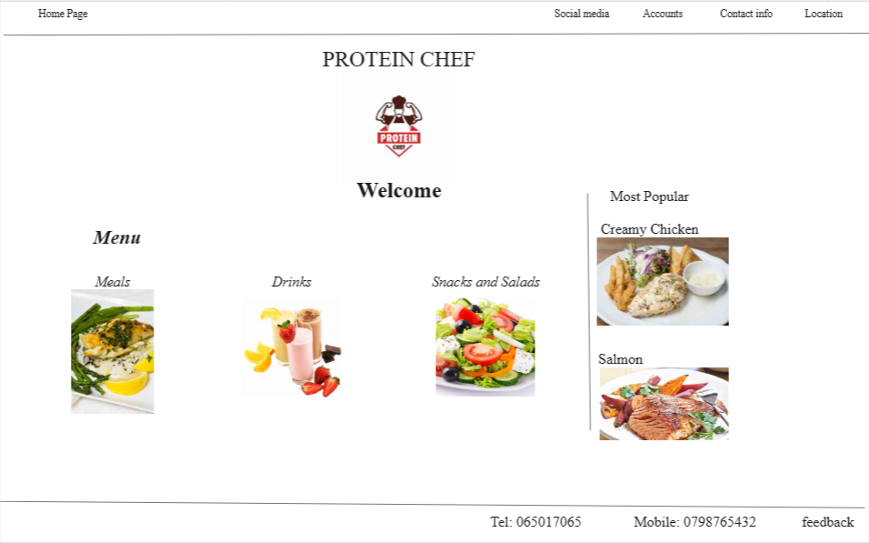

# My-restaurant
[restaurant wireframe](https://miro.com/app/board/uXjVMFgarlk=/?share_link_id=378606487612)

---
## class outcomes:
1. Learn branches and version control.
2. Learn pull request and merging between branches and main branch.
3. Learn what is conflict and how to solve it.
4. Learn Github pages whis is a live preview for HTML, CSS, Markdown and Javascript code.
5. Learn wireframe which is the design part of any project. 